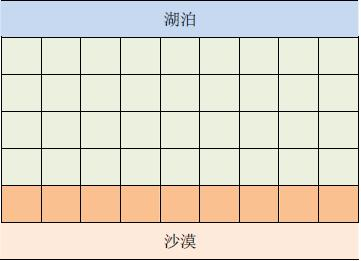
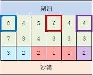
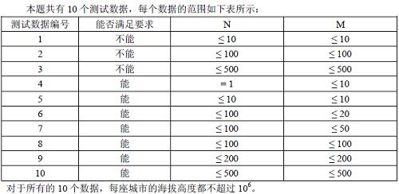

# 引水入城(Divert water into the city)
> 常在区域会使用中英双语，题目区域请自行翻译(English and Chinese are often used in the region. Please translate the topic area).    <!--此句话必须存在(This sentence must exist)-->

### 题目信息(Topic information)

- 题目(topic)：引水入城
- 标签(label)：动态规划 | BFS | NOIp提高组
- 难度(Difficult)：[困难](../difficult)
- 发布时间(release time)：2019-08-24
- 题目链接(Topic link)：[https://www.luogu.org/problem/P1514https://www.luogu.org/problem/P1514

### 题目描述(Description of the topic)

```
题目描述
在一个遥远的国度，一侧是风景秀美的湖泊，另一侧则是漫无边际的沙漠。该国的行政区划十分特殊，刚好构成一个NN 行 \times M×M 列的矩形，如上图所示，其中每个格子都代表一座城市，每座城市都有一个海拔高度。
```

```
为了使居民们都尽可能饮用到清澈的湖水，现在要在某些城市建造水利设施。水利设施有两种，分别为蓄水厂和输水站。蓄水厂的功能是利用水泵将湖泊中的水抽取到所在城市的蓄水池中。

因此，只有与湖泊毗邻的第11 行的城市可以建造蓄水厂。而输水站的功能则是通过输水管线利用高度落差，将湖水从高处向低处输送。故一座城市能建造输水站的前提，是存在比它海拔更高且拥有公共边的相邻城市，已经建有水利设施。由于第NN 行的城市靠近沙漠，是该国的干旱区，所以要求其中的每座城市都建有水利设施。那么，这个要求能否满足呢？如果能，请计算最少建造几个蓄水厂；如果不能，求干旱区中不可能建有水利设施的城市数目。

输入格式
每行两个数，之间用一个空格隔开。输入的第一行是两个正整数N,MN,M，表示矩形的规模。接下来NN 行，每行MM 个正整数，依次代表每座城市的海拔高度。

输出格式
两行。如果能满足要求，输出的第一行是整数11，第二行是一个整数，代表最少建造几个蓄水厂；如果不能满足要求，输出的第一行是整数00，第二行是一个整数，代表有几座干旱区中的城市不可能建有水利设施。

输入输出样例

输入1：                               输出1：
+------------------+                 +------------------+
|2 5               |                 |1                 |
|9 1 5 4 3         |                 |1                 |
|8 7 6 1 2         |                 +------------------+
+------------------+

输入2：                               输出2：
+------------------+                 +------------------+
|3 6               |                 |1                 |
|8 4 5 6 4 4       |                 |1                 |
|7 3 4 3 3 3       |                 +------------------+
|3 2 2 1 1 2       |
+------------------+

说明/提示
【样例1 说明】

只需要在海拔为99 的那座城市中建造蓄水厂，即可满足要求。

【样例2 说明】
```

```
上图中，在3 3个粗线框出的城市中建造蓄水厂，可以满足要求。以这3 3个蓄水厂为源头在干旱区中建造的输水站分别用3 种颜色标出。当然，建造方法可能不唯一。

【数据范围】
```


### 参考答案(Reference answer)

> 注意：任何在线评测系统都会注重学术诚信，本答案只提供题目思路的参考，请遵守评测系统的相关解题诚信说明(Any online evaluation system will pay attention to academic integrity. This answer only provides a reference for the problem ideas. Please follow the evaluation system.)。

思路主线：DFS+ 贪心

1. DFS出每个点所能控制的左边界，右边界，用c[i]记录。
2. b[i]表示能否到达干旱区的第i号点。
3. 扫一遍b[i]看看有多少干旱区不可能建有水利设施。
4. 如果没有干旱区不可能建有水利设施，则贪心的跑一遍区间覆盖。


**参考代码(Reference Code)**

```C++
#include<cstdio>
#include<iostream>
#include<cstring>
#include<cmath>
#include<algorithm>
using namespace std;
int a[505][505],b[505],bo[505][505];
int n,m;
inline void read(int &a)//快读
{
    int k=1;a=0;
    char c=getchar();
    while (c<'0'||c>'9')
    {if (c=='-')k=-1;c=getchar();}
    while (c>='0'&&c<='9')
    {a=a*10+c-'0';c=getchar();}
    a*=k;
}
struct f{
    int l;
    int r;
}c[10005],d[10005];//记录左右边界
int cmp(f A,f B)//位贪心以左端点优先排序
{
    if (A.l!=B.l)
    return A.l<B.l;
    return A.r<B.r;
}
void dfs(int x,int y,int wz)//求出蓄水厂控制区域
{
    if(x<1||x>n||y<1||y>m)
    return ;
    bo[x][y]=1;
    if (x==n)
    {
        b[y]=1;
        c[wz].l=min(c[wz].l,y);
        c[wz].r=max(c[wz].r,y);
    }
    if (a[x][y]>a[x+1][y]&&bo[x+1][y]!=1&&x!=n)
    dfs(x+1,y,wz);
    if (a[x][y]>a[x-1][y]&&bo[x-1][y]!=1&&x!=1)
    dfs(x-1,y,wz);
    if (a[x][y]>a[x][y-1]&&bo[x][y-1]!=1&&y!=1)
    dfs(x,y-1,wz);
    if (a[x][y]>a[x][y+1]&&bo[x][y+1]!=1&&y!=m)
    dfs(x,y+1,wz);
}
int main()
{
    int i,j;
    cin>>n>>m;
    for (i=1;i<=n;i++)
    {
        for (j=1;j<=m;j++)
        {
            if (i==1)
            {
                c[j].l=2147483647;
            }
            read(a[i][j]);
        }
    }
    for (i=1;i<=m;i++)
    {
        if (a[1][i-1]<=a[1][i]&&a[1][i+1]<=a[1][i])
        dfs(1,i,i);
        memset(bo,0,sizeof(bo));
    }
    int sum=0,t1=0;
    for (i=1;i<=m;i++)
    {
        if (b[i]==0)
        sum++;
    }
    if (sum!=0)
    {
        cout<<"0"<<endl;
        cout<<sum<<endl;
    }
    else
    {
        cout<<"1"<<endl;
        for (i=1;i<=m;i++)
        {
            if (c[i].l!=2147483647&&c[i].r!=0)
            {
                d[++t1].l=c[i].l;
                d[t1].r=c[i].r;
            }
        }
        sort(d+1,d+t1+1,cmp);
        int i1=1,t12=1,ans=0;
        while(t12<=m)//贪心区间覆盖
        {
            int t123=0;
            while (d[i1].l<=t12)
            {
                t123=max(t123,d[i1].r);
                i1++;
            }
            t12=t123+1;
            ans++;
        }
        cout<<ans<<endl;
    }
    return 0;
}
```

### 其他优秀解答(Other excellent answers)

请参考CSDN博客liusu201601的解答[https://blog.csdn.net/liusu201601/article/details/79801394](https://blog.csdn.net/liusu201601/article/details/79801394).