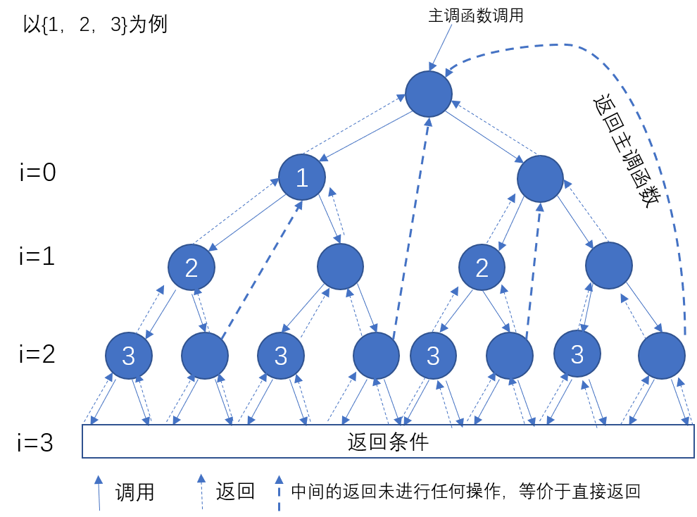
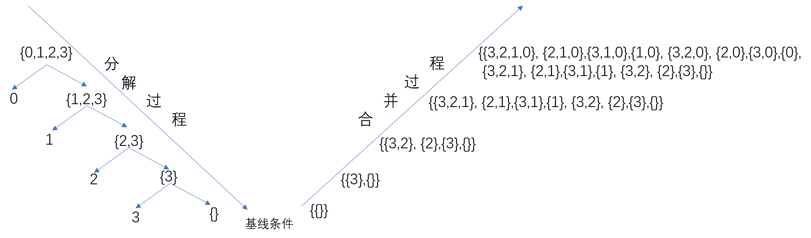

# 子集(Subset)
> 常在区域会使用中英双语，题目区域请自行翻译(English and Chinese are often used in the region. Please translate the topic area).

### 题目信息(Topic information)

- 题目(topic)：子集
- 标签(label)：位运算 | 数组 | 回溯
- 难度(Difficult)：[中等](../medium)
- 发布时间(release time)：2019-09-03
- 题目链接(Topic link)：[https://leetcode-cn.com/problems/subsets/](https://leetcode-cn.com/problems/subsets/)

### 题目描述(Description of the topic)

```
给定一组不含重复元素的整数数组 nums，返回该数组所有可能的子集（幂集）。

说明：解集不能包含重复的子集。

示例:

输入: nums = [1,2,3]
输出:
[
  [3],
  [1],
  [2],
  [1,2,3],
  [1,3],
  [2,3],
  [1,2],
  []
]
```

### 参考答案(Reference answer)

> 注意：任何在线评测系统都会注重学术诚信，本答案只提供题目思路的参考，请遵守评测系统的相关解题诚信说明(Any online evaluation system will pay attention to academic integrity. This answer only provides a reference for the problem ideas. Please follow the evaluation system.)。

1、回溯法算法思路及代码实现
回溯法：回溯法又称试探法，有点类似于枚举法，但回溯法在搜索过程中可以根据约束条件进行剪枝（避免不必要的搜索），是一种较为通用的搜索算法。其采用深度优先策略，从根节点出发，递归地搜索解空间树，直到找到解或者最后穷尽解空间树后返回。
本题的回溯法算法设计如图所示:

使用代码

C++
```C++
void  compute(vector<vector<int>>&subset_set,
              vector<int>& nums,vector<int>&now_set,int i){
    
    if(i>=nums.size()){
        return;
    }
    now_set.push_back(nums[i]);
    subset_set.push_back(now_set);
    compute(subset_set,nums,now_set,i+1);   
    now_set.pop_back();
    compute(subset_set,nums,now_set,i+1);
    return;
}

class Solution {
public:
    vector<vector<int>> subsets(vector<int>& nums) {
        vector<vector<int>>subset_set;//保存最终结果
        vector<int>now_set={};
        subset_set.push_back(now_set);       
        compute(subset_set,nums,now_set,0);
        return subset_set;
    }
};
```
> 运行结果：8ms,90.57%;12.4MB,14.99%。可见递归程序比较浪费空间，因为每次调用，要创建新栈空间来存储函数作用域内的变量和数据。

2、分治法算法思路及代码实现
分治思想，有如下图：

//迭代循环实现

C++
```C++
class Solution {
public:
    vector<vector<int>> subsets(vector<int>& nums) {
        vector<vector<int>>subset_set;
        subset_set.push_back({});
        for(int i=0;i<nums.size();i++){
            int k=subset_set.size();
            for(int j=0;j<k;j++){
                subset_set.push_back(subset_set[j]);
                subset_set[j].push_back(nums[i]);
            }
        }
        return  subset_set;        
    }
};
```
> 运行结果：12ms,64.78%;8.9MB,91.01%.

//递归函数实现

C++
```C++
class Solution {
public:
    vector<vector<int>> subsets(vector<int>& nums) {
        if(nums.size()==0){
            return {{}};
        }
        int temp_int=nums.back();
        nums.pop_back();
        vector<vector<int>>temp_vec_vec=subsets(nums);
        int k=temp_vec_vec.size();
        for(int i=0;i<k;i++){
            temp_vec_vec.push_back(temp_vec_vec[i]);
            temp_vec_vec[i].push_back(temp_int);
        }
        return temp_vec_vec;
    }
};
```
> 运行结果：12ms,64.78%;9.3MB,28.12%.

3、位运算算法及代码实现
算法思想：实际上就是编码的思想，与数组中的值的大小无关。也即是说，给nums数组中每一个元素赋予一个唯一的标记，同时设想让每一个子集中所有单个元素的组合都用其所含的单个元素的编码的组合表示，这样每一个子集也就唯一对应一个编码，所以我们能通过单个元素的编码和每个子集的编码进行比较而轻易地知道这个元素在不在这个子集中。那所以问题地关键就变成了如何给单个元素编码才能达到上述目的。于是，这时候独热码（one-hot-coding，二进制码，其中只有一位是1，其余都是0）就派上用场了。关于独热码，大家可以自行查资料很好理解的。因为我们用连续的独热码依次标记nums数组的每一个元素（比如nums={1,2,4}，则1对应001，2对应010，4对应100，再次提醒这里元素对应的m编码与元素本身的值无关），而各种元素形成的各类子集，就可以用各元素的编码的与运算得到，即子集获得了一个唯一的标记（例如子集{1,3},其标记码为101，由1和3的编码001和100与运算得到），所以如果某个子集和某个元素各自的编码进行与运算为真，则该元素一定在这个子集中，否则不在。另外巧妙的是刚好每个子集的编码对应的数值刚好可以从0（对应空集）到2^n-1。

代码实现：

C++
```C++
class Solution {
public:
    vector<vector<int>> subsets(vector<int>& nums) {
        vector<vector<int>>subset_set;
        int subset_num=1<<nums.size();
        for(int i=0;i<subset_num;i++){
            vector<int>subset;
            for(int j=0;j<nums.size();j++){
                if(i&1<<j){
                    subset.push_back(nums[j]);
                }
            }
            subset_set.push_back(subset);
        }
        return subset_set;
    }
};
```
> 运行结果：8ms,90.57%;9.1MB,61.35%.


**参考代码(Reference Code)**

```C++
//迭代循环实现
class Solution {
public:
    vector<vector<int>> subsets(vector<int>& nums) {
        vector<vector<int>>subset_set;
        subset_set.push_back({});
        for(int i=0;i<nums.size();i++){
            int k=subset_set.size();
            for(int j=0;j<k;j++){
                subset_set.push_back(subset_set[j]);
                subset_set[j].push_back(nums[i]);
            }
        }
        return  subset_set;        
    }
};

//递归函数实现
class Solution {
public:
    vector<vector<int>> subsets(vector<int>& nums) {
        if(nums.size()==0){
            return {{}};
        }
        int temp_int=nums.back();
        nums.pop_back();
        vector<vector<int>>temp_vec_vec=subsets(nums);
        int k=temp_vec_vec.size();
        for(int i=0;i<k;i++){
            temp_vec_vec.push_back(temp_vec_vec[i]);
            temp_vec_vec[i].push_back(temp_int);
        }
        return temp_vec_vec;
    }
};
```

### 其他优秀解答(Other excellent answers)

[暂无]()