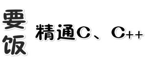

# 代码的天堂

简体中文 | [English](./README_en.md)

---

这个是目前比较流行的在线评测系统的非官方代码解析库（如洛谷、力扣、CCF程序设计在线评测系等）、计算机程序设计指南库、算法刨析库、业界重大新闻/要闻推送库，`为了方便同学们对不会的题目进行参考，我们会尽可能的为大家详细的解释算法和过程`，大家有兴趣可以看一下，如果对这个项目感兴趣，请点击一下Star， 项目会长久更新，感谢大家的支持。

### 介绍

各评测系统题解，记录自己的解题之路。

本库现在分为以下四个部分：

1. 评测系统题目答案算法及解析；
2. 算法图解；
3. 精选题目推送 `每日一题是在交流群（QQ或其他）里进行的一种活动，大家在一起共解一道题，这样讨论问题更加集中，会得到更多的反馈。而且这些题目可以被记录下来，日后会进行筛选添加到仓库的题解模块`；
4. 精选算法/文章推荐；
5. 计划 `这里会记录将来要加入到以上三个部分内容`；

### 关于我

我是一个对技术充满兴趣的开发, 擅长服务端通信，客户端开发与交互，前端标准化开发，数据库设计等。
做过.NET，SQL，WPF，搞过C#、C++，HTML，现在是一名"要饭工程师"。

有需要什么帮助可以直接群里联系我，或者发送到我的个人邮箱 [evilrabbit520@gmail.com]。

### 指南

- 对于最近添加的部分， 后面会有 ✔ 标注
- 对于最近更新的部分， 后面会有 🆙 标注

其中算法，主要是以下几种：

- 基础技巧：分治、二分、贪心
- 排序算法：快速排序、归并排序、计数排序
- 搜索算法：回溯、递归、深度优先遍历，广度优先遍历，二叉搜索树等
- 图论：最短路径、最小生成树
- 动态规划：背包问题、最长子序列

数据结构，主要有如下几种：

- 数组与链表：单 / 双向链表
- 栈与队列
- 哈希表
- 堆：最大堆 ／ 最小堆
- 树与图：最近公共祖先、并查集
- 字符串：前缀树（字典树） ／ 后缀树

### 传送门

#### 经典题目的解析

> 这里仅列举具有代表性题目，并不是全部题目（很多题目还在制作中，您可以先**标星**稍后再来参考）

**简单难度**

- [洛谷_绘制超级马里奥P1000](./Analysis/simple/2019-08-23_绘制超级马里奥P1000.md) ✔

**中等难度**

- [洛谷_幸福之路P1556](./Analysis/medium/2019-08-23_幸福之路P1556.md) 🆙
- [Leetcode_145二叉树的后序遍历](./Analysis/Data-structure-and-algorithm-code/2019-08-24_144二叉树的前序遍历.md) ✔

**困难难度**

- [洛谷_引水入城P1514](./Analysis/Data-structure-and-algorithm-code/2019-08-24_144二叉树的前序遍历.md) ✔
- [2019-09-01_正则表达式匹配LeetCode10](./Analysis/diffficult/2019-09-01_正则表达式匹配LeetCode10.md) ✔

**地狱难度**

#### 数据结构与算法的总结

- [二叉树的遍历](./Analysis/DataStructureAndAlgorithm/二叉树的遍历.md) 🆙

#### 精选题目

#### 精选文章

- [C++ 类 & 对象](./article/ClassAndObject.md) ✔

### 交流群

>因为现在还是初级阶段等种种原因，我们还是暂先选用QQ群作为交流媒介

我们不排斥新手朋友，只要你热爱，我们欢迎你！

QQ群号：[864265068](https://jq.qq.com/?_wv=1027&k=5GIj36O)

**二维码**

### 贡献

项目共享参阅[贡献榜](https://github.com/Evilrabbit520/Hall/graphs/contributors)，感谢您对开源社区和本项目的支持，我们会不定期对贡献榜中部分成员进行实物奖励。

- 如果有想法和创意，请提[issue](https://github.com/Evilrabbit520/Hall/issues)或者进群提
- 如果想贡献代码，请提[Pulls](https://github.com/Evilrabbit520/Hall/pulls)
- 如果发布新题目请使用[题目模板](./template/Template.md)

### 执照

[Apache-2.0](./LICENSE.txt)
